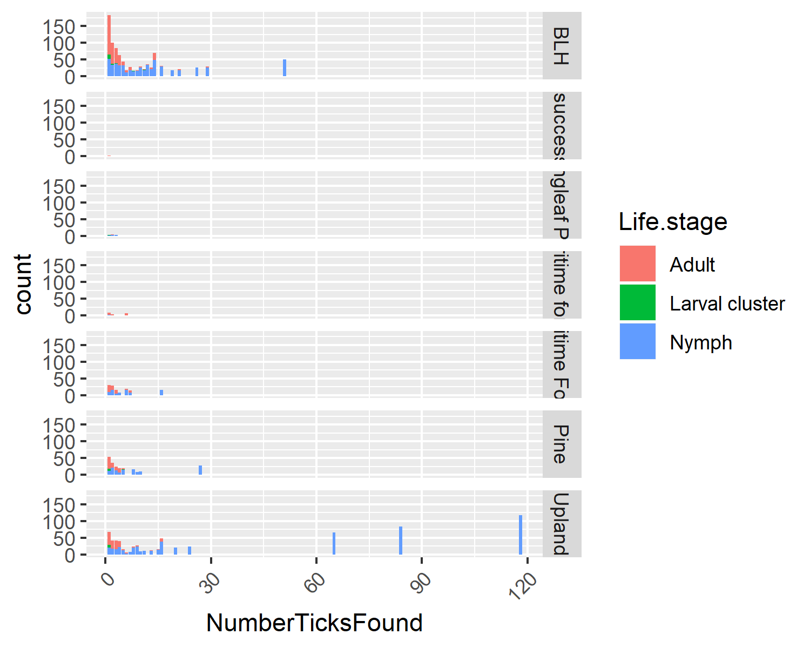

# Summary/Abstract
_Write a summary of your project._

Note that this cited reference will show up at the end of the document, the reference formatting is determined by the CSL file specified in the YAML header. Many more style files for almost any journal [are available](https://www.zotero.org/styles). You also specify the location of your bibtex reference file in the YAML. You can call your reference file anything you like, I just used the generic word `references.bib` but giving it a more descriptive name is probably better.


# Introduction (required for part 1)

## General Background Information
_Provide enough background on your topic that others can understand the why and how of your analysis_  
Tickborne disease prevalence is on the rise in the United States with 50,000 cases being confirmed by the CDC each year. Lyme disease alone is the number one vector borne disease reported in the U.S. each year with over 30,000 cases, and the Center for Disease Control and Prevention (CDC) estimating over 300,000 cases actually occurring [@CDC]. A single species of tick is capable of transmitting multiple disease pathogens [@Adelson]. For example, Ixodes scapularis has a range covering the entire eastern half of the U.S. and is capable of transmitting pathogens that cause Lyme disease, anaplasmosis, ehrlichiosis, babesiosis, and Powassan virus [@Adelson; @Dantas].  There are multiple tick species native to the U.S. that can spread at least one human disease, and the consequences of increased globalization and livestock trade are becoming apparent with invasive species making landfall [@Jongejan]. When investing multiple tick species, it becomes clear that each species has its own variation in lifecycle and disease prevalence that comes along with it. Knowing what these differences are give researchers the power to create control and prevention efforts for human disease. Current vector research is focusing on understanding the biology of these vectors in order to put future range expansions [@Ginsberg], and increased disease threat [@Eisen; @Arsnoe] into a clearer context. Our research aims to define trends over time in tick species looking into pathogen prevalence, and microbiome shifts. This information will inform future efforts to model disease expansion across the U.S. and into Canada. 

## Description of data and data source
_Describe what the data is, what it contains, where it is from, etc._  
Through the Southeastern Coopertative Wildlife Disease Study (SCWDS) ticks were collected from the eastern region of the United States over the course of a year, the ticks used in this study were all from Georgia. When collected the habitat type and location was recorded for future reference. These ticks were then IDed, and used for 16S and PCR in order to determine the presence of pathogens and the microbial community within each specimen. The pathogen and microbial community will not be investigated genetically, instead we will be determining changes in prevalence over time and space. The data used for this analysis includes the pathogens *Rickettsia*, *Ehrlichia ewingii*, *Ehrlichia chaffeensis*, *Anaplasma phagocytophilum*, *Borrelia spp*, and Panola Mountain Ehrlichia (PME). There are multiple tick species that were identified through morphology, and the life stage the tick was collected. The habitat information includes: season, region, site, and general habitat. 

## Questions/Hypotheses to be addressed
_State the research questions you plan to answer with this analysis_  
__1. How the habitat effects the prevalence of pathogens in ticks?__  
The habitats are broken into a few different locations, some more rural than others. The effect of habitat on pathogen prevalence is likely due to the different community make-up in each location. Doing this will give us an idea of how the community can sway pathogen prevalence in the select environment. In order to answer this question we will use an ANOVA, looking at habitat type and specific pathogen.  
__2. How the microbial composition changes with the prevalence of pathogens?__  
This data will give insight into how the microbial community and pathogen prevalence shift with or against each other over a period of time. It will show future intereactions that can be on interest within the microbiome of a tick. We will be using Chi squared tests to look at these changes and the interactions.   
__3. How pathogen prevalence shifts over time within different habitats?__  
This will show how changes in habitat, likely due to temperature and humidity changes, effects the pathogen prevalence in a single area. We will be comparing habitats to each other through ANOVA tests.   


# Methods and Results
_In most research papers, results and methods are separate. You can combine them here if you find it easier. You are also welcome to structure things such that those are separate sections._ 

## Data aquisition
_As applicable, explain where and how you got the data. If you directly import the data from an online source, you can combine this section with the next._  
Through the Southeastern Coopertative Wildlife Disease Study (SCWDS) ticks were collected from the eastern region of the United States over the course of a year, the ticks used in this study were all from Georgia. In order to collect the ticks typical drag sampling was done in each transect of the area, with checks being done of the drag every 10m. When collected the habitat type and location was recorded for future reference. These ticks were then IDed through morphology, and used for 16S and PCR in order to determine the presence of pathogens and the microbial community within each specimen. The pathogen and microbial community will not be investigated genetically, instead we will be determining changes in prevalence over time and space. The data used for this analysis includes the pathogens *Rickettsia*, *Ehrlichia ewingii*, *Ehrlichia chaffeensis*, *Anaplasma phagocytophilum*, *Borrelia spp*, and Panola Mountain Ehrlichia (PME). The habitat information includes: season, region, site, and general habitat. The raw data can be found in the project file `./data/raw_data/RawDataTickPathLoc.csv`. This data is used for the analysis. 

## Data import and cleaning
_Write code that reads in the file and cleans it so it's ready for analysis. Since this will be fairly long code for most datasets, it might be a good idea to have it in one or several R scripts. If that is the case, explain here briefly what each file does. The files themselves should be commented well so everyone can follow along._  
```{r setup}

knitr::opts_chunk$set(warning=FALSE)

#load needed packages. make sure they are installed.
library(readxl)
library(dplyr)
library(DataCombine)
library(ggplot2)
library(stats)
library(reshape2)

#load data. path is relative to project directory.
#plateres <- read.csv("./data/raw_data/CompiledPlateResults.csv")
tickpath <- read.csv("../../data/raw_data/RawDataTickPathLoc.csv",na.strings = c("", "NA"))
    #Add NA to observations where pathogen species was not tested (all observations without neg/pos were not tested)
    #Where sex is blank it is a nymph or larval cluster which do not currently phenotypically sex -> add NA to those columns

#take a look at the data
dplyr::glimpse(tickpath)
#Note to self PME = Panola Mountain Ehrlichia

####Processing data####

#Renaming columns that don't convert from the .csv file
names(tickpath)[1]<-"Season"
names(tickpath)[5]<-"TransectNum"
names(tickpath)[6]<-"TickID"

#Renaming the "Borrelia.spp." column to not have the . at the end
names(tickpath)[14]<-"Borrelia.spp"
 
#Checking that all factors are coded correctly
levels(tickpath$Site)
  ##Some sites have spaces at the end that shouldn't be there, 
    #or have two names for the same place
tickpath$Site <- replace(tickpath$Site, tickpath$Site == "Sewee ", "Sewee")
tickpath$Site <- replace(tickpath$Site, tickpath$Site == "SRS North", "SRS N")
tickpath$Site <- replace(tickpath$Site, tickpath$Site == "SRS S ", "SRS S")
tickpath$Site <- replace(tickpath$Site, tickpath$Site == "Wando ", "Wando")
tickpath$Site <- replace(tickpath$Site, tickpath$Site == "FM McConnell", "McConnell")
tickpath$Site <- factor(tickpath$Site) 
levels(tickpath$Site)

levels(tickpath$Habitat)
  ##Subset of "Upland" has an extra space at the end
tickpath$Habitat <- replace(tickpath$Habitat, tickpath$Habitat == "Upland ", "Upland")
tickpath$Habitat <- factor(tickpath$Habitat) 
levels(tickpath$Habitat)

levels(tickpath$Species)
  ##Species has duplicated, one has an extra space at the end
  #"Ixodes scapularis"      "Ixodes scapularis " Want to remove the space from the second
tickpath$Species <- replace(tickpath$Species, tickpath$Species == "Ixodes scapularis ", "Ixodes scapularis")
tickpath$Species <- factor(tickpath$Species) 
levels(tickpath$Species)


#Each pathogen species that is tested is listed at "Pos___" or "Neg___" with 3 letters corresponding to the pathogen
  #need to transform to 0 for neg, 1 for positive
positiveNames <- c("PosRick","PosEew", "PosEch", "PosAna", "PosBor", "PosPME")
negNames <- c("NegRick", "negRick", "NegEew", "NegEch", "NegAna", "NegBor", "NegPME", "NegPMe")
columnNames <- c("Rickettsia", "Ehrlichia.ewingii", "Ehrlichia.chaffeensis", "Anaplasma.phagocytophilum", "Borrelia.spp", "PME")

#creating a dataframe that will have what needs to be changed and to what
preplacedf <- data.frame("Current" = positiveNames, "New" = 1)
nreplacedf <- data.frame("Current" = negNames, "New" = 0)
replacedf <- rbind(preplacedf, nreplacedf)

#FindReplace is from the DataCombine package
for (i in columnNames){
  tickpath <- FindReplace(tickpath, i, replacedf, from = "Current", to = "New", exact = TRUE)
}

#Change from character strings to numeric
sapply(tickpath, class)
tickpath[columnNames] <- sapply(tickpath[columnNames], as.numeric)
sapply(tickpath, class)

#Need total number of ticks found in each transect
Totaltick<-tickpath %>% 
  group_by(Season, Region, Site, Habitat, TransectNum, Species) %>%
  count(Species)
names(Totaltick)[7]<-"NumberTicksFound"

tickpath<-merge(x=tickpath,y=Totaltick, by=c("Season","Region","Site","Habitat","TransectNum","Species"))

##Need to reorder the seasons to put them in chronological order
levels(tickpath$Season)
tickpath$Season <- factor(tickpath$Season, levels = c("Spring", "Summer", "Fall", "Winter"))
levels(tickpath$Season)

saveRDS(tickpath, file = "../../data/processed_data/processeddata_tickpath.rds")
saveRDS(Totaltick, file = "../../data/processed_data/processeddata_Totaltick.rds")

```


```{r prelimanalysis}
#load needed packages. make sure they are installed.
library(ggplot2)
library(dplyr)
library(broom)
library(reshape2)

#load data. path is relative to project directory.
tickpath <- readRDS("../../data/processed_data/processeddata_tickpath.rds")

#How the habitat effects the prevalence of pathogens in ticks?
  #Total number of positive tests found in a habitat broken down by species.
  #Creating the number of total pathogens
tickpath$TotalPath <- rowSums(tickpath[,c("Rickettsia", "Ehrlichia.ewingii",
                                          "Ehrlichia.chaffeensis", "Anaplasma.phagocytophilum", 
                                          "Borrelia.spp", "PME")], na.rm=TRUE)
#Associating all pathogen tests on a single tick with that tick
meltpath <- melt(tickpath, id.vars=c("Season","Region","Site","Habitat","TransectNum","TickID",
                                     "Species","Sex","Life.stage","TotalPath","NumberTicksFound"))

speciesLand<-meltpath %>%
  ggplot(aes(x=Habitat,y=value, fill=variable)) +
  geom_bar(stat = "identity") +
  theme(axis.text.x = element_text(angle = 90, hjust = 1)) +
  facet_wrap(.~Species)

ggsave(filename="../../results/speciesLandfigure.png",plot=speciesLand) 

# fit linear model
lmfitSpecies <- lm(Habitat ~ Species, meltpath)  
lmfitSpecies
# place results from fit into a data frame with the tidy function
lmtableSpecies <- broom::tidy(lmfitSpecies)
lmtableSpecies
# save table  
saveRDS(lmtableSpecies, file = "../../results/resulttableSpecies.rds")

#How the tick lifestage prevelance is changed within habitat?
lifeLand<-tickpath %>%
  ggplot(aes(x=NumberTicksFound, fill=Life.stage)) +
  geom_bar() +
  theme(axis.text.x = element_text(angle = 45, hjust = 1)) +
  facet_grid(Habitat~.)
#Nymphal Amblyomma americanum is by far the most prevelant
#Ixodes scapularis adults peak in the Fall, and A.A. peaks in summer

ggsave(filename="../../results/lifeLandfigure.png",plot=lifeLand) 

# fit linear model
lmfitLife <- lm(Life.stage ~ Habitat, tickpath)  
lmfitLife
# place results from fit into a data frame with the tidy function
lmtableLife <- broom::tidy(lmfitLife)
lmtableLife
# save table  
saveRDS(lmtableLife, file = "../../results/resulttableLife.rds")

```

## Univariate analysis
_Use a combination of text/tables/figures to explore and describe your data. You should produce plots or tables or other summary quantities for most of your variables. You definitely need to do it for the important variables, i.e. if you have main exposure or outcome variables, those need to be explored. Depending on the total number of variables in your dataset, explore all or some of the others._
 
When comparing the prevalence of pathogens in all tick species in different habitats, trends begin to emerge. Here we look at how the total number of positive individuals are broken down by species (fig 1). From here we can see that _Rickettsia_ is the most common pathogen in _A. americanum_. However, for _I. scapularis_ we see that Borrelia species and _Anaplasma_ are the two most common. These results trend with what is in current literature.  
  
Figure 1. Pathogen prevalence per species. This figure shows the number of individuals per species that tested positive for a particular pathogen.  

We can also use this dataset to see if lifestage has any relationship to habitat (fig 2). Overall, we can see that BHL and Upland have the most ticks of any lifestage found throughout it. However, there are pockets in Upland that have large numbers of nymphs found in a single transect which is an interesting phenomenom.   
  
Figure 2. Tick lifestage versus the habitat. This figure shows the number of individuals in each lifestage found in the different habitats.  


## Bivariate analysis
_Create plots or tables and compute simple statistics (e.g. t-tests, simple regression model with 1 predictor, etc.) to look for associations between your outcome(s) and each individual predictor variable_


## Full analysis
_Use one or several suitable statistical/machine learning methods to analyze your data and to produce meaningful figures, tables, etc. This might again be code that is best placed in one or several separate R scripts that need to be well documented. You can then load the results produced by this code_

# Discussion

## Summary and Interpretation
_Summarize what you did, what you found and what it means._

## Strengths and Limitations
_Discuss what you perceive as strengths and limitations of your analysis._

## Conclusions
_What are the main take-home messages?_


_Include citations in your Rmd file using bibtex, the list of references will automatically be placed at the end_

# References

