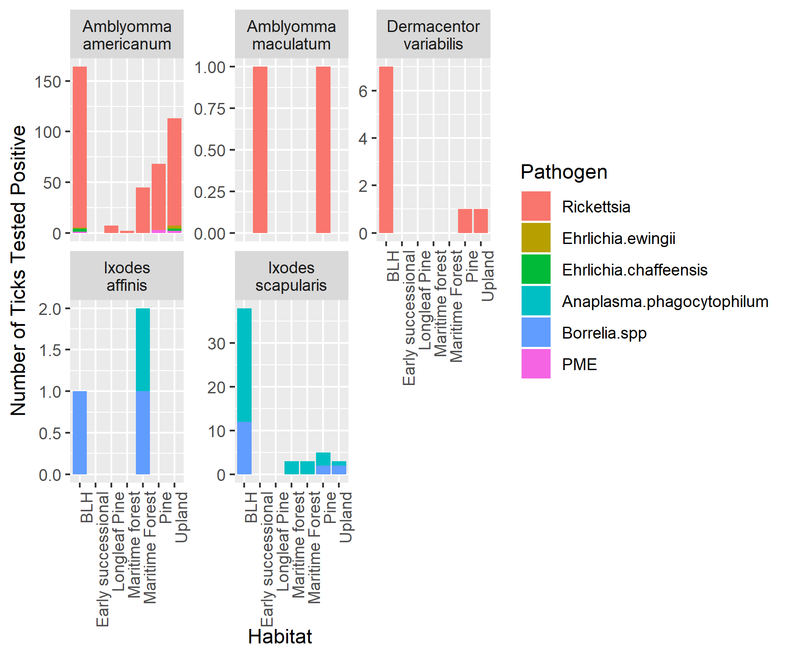
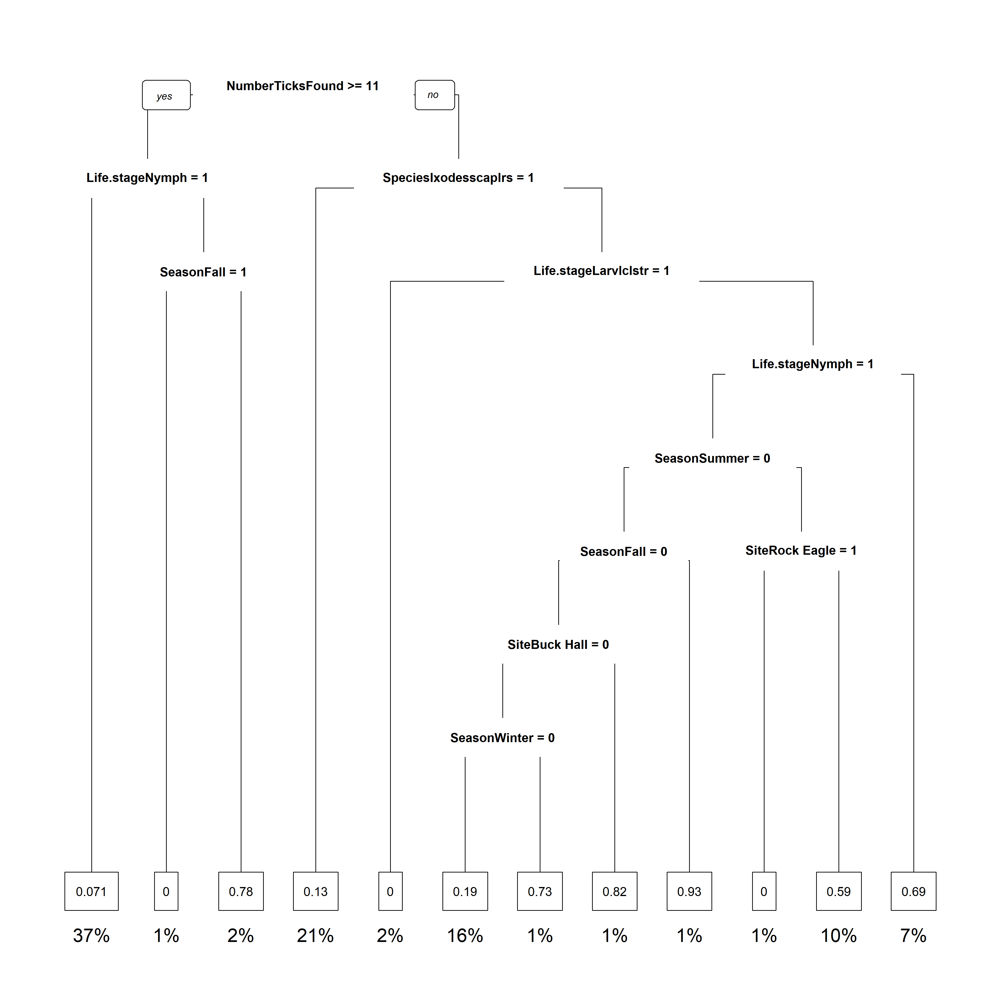

# Summary/Abstract
Tick-borne disease is increasingly a public health concern in the United States. With more that 50,000 cases being confirmed annually by the CDC and estimating a 10-fold higher case rate actually occurring, understanding the disease system at play is of the utmost importance. Through tick dragging, almost 2000 individuals were collected, ID-ed through morphology, and tested using PCR for pathogens in order to determine how the environment determines the risk for disease. This data is use to determine how habitat can influence pathogen prevalence, which readily available factors are contributing to disease risk, and how specific disease system vary from overall tick-borne disease. Through this research it is confirmed that tick population size, and season are two major factors in determining disease risk. When you look specifically at the Lyme disease system using *Ixodes scapularis* and *Borrelia spp.* you see that the season and region are the main contributing factors, and population size falls off. This shows that understanding the overall dynamics of tick-borne disease can be useful but that it cannot apply across all individual disease systems. 


# Introduction
## General Background Information
Tick-borne disease prevalence is on the rise in the United States with 50,000 cases being confirmed by the CDC each year. The number one vector borne disease in the US is Lyme disease with 30,000 cases reported annually, and the Center for Disease Control and Prevention (CDC) estimating over 300,000 cases actually occurring [@CDC]. Understanding how these pathogens are being moved throughout the environment and what influences higher prevalence gives insight into risk prevention efforts and effective targets. Especially when considering that a single species of tick is capable of transmitting multiple disease pathogens [@Adelson]. There are multiple tick species native to the U.S. that can spread at least one human disease, and the consequences of increased globalization and livestock trade are becoming apparent with invasive species making landfall [@Jongejan]. For example, native species, _Ixodes scapularis_ has a range covering the entire eastern half of the U.S. and is capable of transmitting pathogens that cause Lyme disease, anaplasmosis, ehrlichiosis, babesiosis, and Powassan virus [@Adelson; @Dantas]. Multiple of these pathogens have been found in a single tick during field studies (co-infection) [@moutailler2016co].  

Current research focusing on the dynamics of these co-infections has shown there to be correlations between specific pathogens occurring in higher frequencies [@abraham]. These co-infections can have an impact on human health and diagnostic tests used for detecting the specific pathogens [@krause2014borrelia; @krause2018human]. This isn't only an issue within species, because many tick species are the main vector for specific pathogens and these species can feed on the same source which will mingle the pathogens between species. In general, a single tick can carry pathogens they are highly competent for along with pathogens that they are less or non-competent for. Some of these co-infections  have been shown to increase transmission potential of some pathogens. For example, when *Borrelia burgdorferi* is co-infected with *Anaplasma phagocytophilum* there is a shift in the gut microbiota of the tick that allows *B. burgdorferi* to more effectively colonize the gut [@abraham]. These dynamics within a tick and between pathogens need to be further investigated. Background information on prevalence rates of different pathogens in the same habitat is an important basis for future research.   

Within a single habitat multiple tick species co-exist. When investigating multiple tick species, it becomes clear that each species has its own variation in life cycle and disease prevalence that comes along with it. Knowing what these differences are give researchers the power to create control and prevention efforts for human disease. Two of the main species covered in this research are *I. scapularis* and *Amblyomma americanum*, which are a good comparision for how different species can have shifted phenology. *Ixodes scapularis* nymphs are more active into the Fall season while *A. americanum* nymph activity peaks in the Summer. Even daily differences in *I. scapularis* and *A. americanum* activity vary where *I. scapularis* ticks are more active earlier and later in the day and *A. americanum* ticks are active in the afternoon [@schulze2001effects]. Current vector research as a whole is focusing on understanding the biology of these vectors in order to put future range expansions [@Ginsberg], and increased disease threat [@Eisen; @Arsnoe] into a clearer context. Our research aims to define trends over time and across habitats in tick species through pathogen prevalence.  

Within this research we will be focusing on data that is derived from ticks collected throughout the southeast. Most of the ticks that were used in this study are *I. scapularis* and *A. americanum*, the majority of ticks were tested for both *Borrelia spp.* and *A. phagocytophilum*, and the habitat and region of collection were recorded. The habitats include Bottomland Hardwood (BLH), Maritime Forest, Longleaf Pine, Upland, Pine, and Early successional. Each of these habitats were determined by tree density, canopy closure, ground cover composition, litter depth, microclimatic measurements, and weather data. Due to the determining factors, the habitats used in this study are assumed to have different levels of tick activity, and different species composition for ticks and pathogens. This information will inform future efforts to model disease expansion across the U.S. and into Canada. Especially because tick-borne disease spread is expanding its range northward due to climate change [@medlock2015effect].  

## Description of data and data source
Through the Southeastern Cooperative Wildlife Disease Study (SCWDS) ticks were collected from the southeast United States (Georgia, South Carolina, and North Carolina) over the course of a year. When collected the habitat type and location was recorded for future reference. These ticks were then ID-ed through morphology, after which DNA was extracted and used to test the 16S region for PCR in order to determine the presence of pathogens. The pathogens will not be investigated genetically, instead we will be determining changes in prevalence over time and space. The raw data from `RawDataTickPathLoc.csv` contains 1968 observations, and 15 variables. The data used for this analysis includes the pathogens *Rickettsia*, *Ehrlichia ewingii*, *Ehrlichia chaffeensis*, *Anaplasma phagocytophilum*, *Borrelia spp*, and Panola Mountain Ehrlichia (PME). There are multiple tick species that were identified, and samples from each life stage are present. The habitat information includes: season, region, site, and general habitat. Samples were numbered, and the transect they were collected in was accounted for, however, this data will not be used for analysis. The variables presented in this data file after cleaning are:  

  * `Season` - Categorical. Levels: Fall, Summer, Winter, Spring  
  * `Region` - Categorical. Levels: Lower Coastal, Piedmont, Upper Coastal   
  * `Site` - Categorical. 15 Levels, subset of Region data  
  * `Habitat` - Categorical. Levels: BLH, Early successional, Longleaf Pine, Maritime Forest, Pine, Upland. Determined by environmental factors tree density, canopy closure, ground cover composition, litter depth, microclimatic measurements, and weather data  
  * `Transect #` - Integer. 20 established transects per site, each transect is 25 meters in length so a total of 500m were dragged per site.  
  * `Tick # on transect` - Integer. Each tick collected per transect was assigned a number in sequence starting from 1.  
  * `Species` - Categorical. Levels: Amblyomma americanum, Amblyomma maculatum, Dermacentor variabilis, Ixodes affinis, Ixodes scapularis. Species was assigned to each individual based on morphology.  
  * `Sex` - Categorical. Levels: Male, Female, NA. Only adult ticks have a sex  
  * `Life.stage` - Categorical. Levels: Adult, Larval cluster, Nymph. The larvae need to be pooled as individually they do not contain enough DNA for pathogen detection. However, larvae could only be infected with pathogens that are transovarially passed to the offspring (like *Rickettsia*) and the two pathogens consistently tested for (*A. phagocytophilum* and *Borrelia spp.*) are not known to be transmitted in this way.   
  * `Rickettsia` - Catergorical. Samples that were tested are listed as either positive or negative, if not tested they are listed as NA.  
  * `Enrlichia.ewingii` - Catergorical. Samples that were tested are listed as either positive or negative, if not tested they are listed as NA.  
  * `Ehrlichia.chafeensis` - Catergorical. Samples that were tested are listed as either positive or negative, if not tested they are listed as NA.  
  * `Anaplasma.phagocytophilum` - Catergorical. Samples that were tested are listed as either positive or negative, if not tested they are listed as NA.  
  * `Borrelia.spp` - Catergorical. Samples that were tested are listed as either positive or negative, if not tested they are listed as NA.  
  * `PME` - Catergorical. Samples that were tested are listed as either positive or negative, if not tested they are listed as NA.  

## Questions/Hypotheses to be addressed
__1. How the habitat effects the prevalence of pathogens in ticks?__  
Each region is divided into the habitats listed above, with some regions and habitats more rural than others. The effect of habitat on pathogen prevalence is likely due to the different animal and plant community make-up in each location. Doing this will give us an idea of how the overall community can sway pathogen prevalence in a select habitat. The habitat is a categorical veriable with the levels  Bottomland Hardwood (BLH), Maritime Forest, Longleaf Pine, Upland, Pine, and Early successional that are determined by tree density, canopy closure, ground cover composition, litter depth, microclimatic measurements, and weather data. The prevalence of pathogen in ticks is done by testing for specific pathogens through PCR  targeting the 16S gene.    
__2. What factors have the greatest influence on a tick carrying a pathogen?__  
We will look further into what general variables are influencing pathogen prevalence in the southeast. This data will consider all variables collected that are biologically relevant. Throughout this research we collected data on season, region, site, habitat, transect number, tick number assigned per transect, species, sex, life stage, and results from 16S targeted PCR for pathogens. Variables determined not biologically relevant were transect number as it is arbitarially assigned, and tick number is included in the total number of ticks in a single transect so the randomly assigned number to each individual tick is not relevant.    
__3. What influences *Ixodes scapularis* to have *Borrelia spp.*?__  
We apply the concepts used to model for overall tick-borne pathogen on a specific disease system to see how similar the outcome is for that population of ticks. *Ixodes scapularis* is the main vector for the causitive agent of Lyme disease, *Borrelia burgdorferi*. Borrelia species pathogens fall into the category of Lyme-causing and Relapsing-fever-causing, so even in a broader sense we are still measuring how *I. scapularis* and human causing disease are related, and what factors in an evironment can influence overall disease risk.  
 

# Methods and Results
## Data acquisition
Through the help of SCWDS ticks were collected from the southeast United States (Georgia, South Carolina, and North Carolina) over the course of a year. Tick sampling was conducted at quarterly intervals, with each plot being sampled once per quarter. This allows for evaluation of the phenology of various tick species. Tick sampling was conducted after 10:00 AM, or later if necessary, when vegetation was dry and temperatures were >0 C. No sampling was conducted on days with inclement weather (heavy rain, snow, excessive wind). Adult, nymph and larval ticks were preserved in 70% ethanol. At each site, we established twenty transects, 25 meters in length. Tick drags were completed along these transects for a total of 500 m of dragging per site. Ticks were identified to species, life stage and sex using published dichotomous keys. DNA was extracted from ticks using *Qiagen DNeasy Blood and Tissue* kits and a subset of ticks were tested for pathogens of interest using various PCR assays. A subset of *A. americanum*, *A. maculatum*, and *D. variabilis* nymph and adult ticks were screened for Rickettsia spp. by a nested PCR targeting the 17kDa gene (Gleim et al. 2016). Samples positive for *Rickettsia spp.* were purified and submitted to Georgia Genomics Facility for sequencing to determine species of Rickettsia, we are still waiting for these results. A subset of *A. americanum* ticks was screened for *Ehrlichia chaffeensis* using a nested PCR targeting the 16S gene (Anderson et al. 1992a). A subset of *A. americanum* ticks were screened for *Ehrlichia ewingii* using a nested PCR targeting the 16S gene (Dawson et al. 1996). All *Ixodes scapularis* and *Ixodes affinis* ticks were screened for *Anaplasma phagocytophilum* using a nested PCR targeting the 16S gene (Little et al. 1997). In the original agreement, *Ixodes scapularis* were to be tested for *B. burgdorferi* by the Centers for Disease Control. However, testing has not been conducted so we are currently testing all *Ixodes* spp. for *Borrelia spp.* using a nested PCR targeting the flagellin (flaB) gene (Barbour et al. 1996, Gleim et al. 2016).

When collected the habitat type and location was recorded for future reference. The raw data can be found in the project file `./data/raw_data/RawDataTickPathLoc.csv`. This data is used for the analysis. 


## Data import and cleaning
In order to clean this data we first will import the data so all empty observations are coded as NA. This is done because not all samples were tested for pathogens or for the full array of possible pathogens. Only a subset from each species is tested, as explained above. We first need to recode some variable names as they do not transfer into R in a format that is easily useable. So we change the first column which is the `Season` variable to be named Season as it doesn't always load in properly, the `transect #` to be TransectNum, and the `Tick # on transect` to TickID. Both of the last two are done to remove spaces and to remove the `#` symbol as it can't be used easily in R code. We also rename the `Borrelia.spp.` column to remove the `.` at the end, just for ease. Then we need to adjust some levels within our variables because they have extra spaces, a spelled incorrectly, or are duplicated with slightlt different names. Our orignal data file has 20 levels for the Site variable, however five of those are duplicate names for other levels in the data set. When we combine the duplicates we now only have 15 levels in the Site variable. We need to do the same thing for the "Upland" level in the Habitat variable, and the "Ixodes scapularis" level in the Species variable. We then need to change the character designations for positive and negative outcomes in all of the pathogen testing variables. The original levels are named "Pos" or "Neg" with an abbreviation for the pathogen following the "Pos" and "Neg." Since this is an inconsistent way to record observations, and makes combining the data significantly more difficult, we are going to change all observations to a 1 if they are positive and to a 0 if they are negative. Using this integer scale allows for calculations of the number of different pathogens an individual has, which is done later. A semantic change we need to make for purposes of graphing later is putting the Seasons in order, currently the variable levels do not go chronologically so we are going to reorder the levels so that when they are graphed they appear chronologically. The last thing we want to do for this data set is calculate the total number of ticks in each transect, as the number of individuals could have an impact on disease transmission and prevalence. This is calculated by counting the number of observations in each unique transect, this is saved as the variable `NumberTicksFound`. We save this tidy data set in a complete form which will be used for a majority of this project. We then save a subet of the data that extracts only the *I. scapularis* observations and a subset of the variables that will be focused on (Season, Region, Site, Habitat, TickID, Sex, Life.stage, Anaplasma.phagocytophilum, and Borrelia.spp). Once this general tidying is complete and our files are saved we can now move forward to data wrangling and summarising.  
  
```{r setup, include = FALSE}
library(here)
source(here("./code/processing_code/processingscript.R"))
```

## Univariate analysis
As we begin some of the univariate analysis we need to calculate some new variables for our analysis. This project was begun by a Master's student who needed to take a leave so the project got put on hold for over a year. They were not able to complete pathogen testing for each individual as planned so some of the original goals of this project will need to be shifted for purposes of this project. Instead of being able to analyze each pathogen alone and how it is related to species and habitat, we are going to aggregate the number of unique pathogens found within each individual. This new variable is referred to as `TotalPath` and is used as the main outcome of interest when dealing with all of the species at once in this study. In the future we hope to test for each pathogen across all individuals, however, even in that analysis we will also look at total pathogen as a possible outcome of interest.    
```{r prelimanalysis, include = FALSE }
source(here("./code/analysis_code/1_analysisscript.R"))
```
Samples were collected throughout the southeast (figure 1). This map shows the regions (labels) and the sites (stars) that were proposed for this research, we did not collect sufficent samples in the Mountain region to appropriately include this region in the analysis.  

  
_Figure 1. Map of proposed sampling sites. The labels are the regions, and the stars are the sites within each region._  

The main variable that can account for pathogen prevalence is tick species. We are interested in the breakdown of ticks that were sampled. As we can see in Table 1, *A. americanum* is the most frequently collected tick, with *I. scapularis* in second with about a 3 fold decrease in sample number. The other species collected are negligible, but still important to note they exist within in the same environment so we aren't going to remove them from the whole data set because it is possible they introduce a new pathogen. This data will be further examined by pathogen breakdown.  

_Table 1. Frequency of collection per species. Each species and the number of times collected through drag sampling._
```{r ticknumTable, echo=FALSE}
library(ggplot2)
library(dplyr)
library(pander)
tickpath <- readRDS(here("././data/processed_data/processeddata_tickpath.rds"))
iscapbor <- readRDS(here("././data/processed_data/processeddata_iscapbor.rds"))

tickpath %>%
  group_by(Species) %>%
  summarize(frequency = n()) %>%
  arrange(desc(frequency)) %>%
  mutate(relative_frequency = frequency/sum(frequency),
         relative_frequency = round(100*relative_frequency,2)) %>%
  pander
```

From our data set that focuses on samples that were tested for *Borrelia spp.*, the only species that is included is *I. scapularis*. This species is the main vector for *Borrelia burgdorferi*, and the other species collected in this study are either confirmed to not be vector species for this pathogen or are assumed through prevalence studies to not carry this pathogen. Knowing which region *I. scapularis* is in is an important metric for disease prevention. In table 2, 50% of *I. scapularis* samples were collected from the Piedmont region. Further studies will be done to know which regions have the highest prevalence of *I. scapularis* ticks testing positive for *Borrelia spp.*  

_Table 2._ I. scapularis _collections by region. Shows the frequency of_ I. scapularis _samples collected across the different regions._
```{r tableBor, echo=FALSE}
iscapbor <- readRDS(here("././data/processed_data/processeddata_iscapbor.rds"))
iscapbor %>%
  group_by(Region) %>%
  summarize(frequency = n()) %>%
  arrange(desc(frequency)) %>%
  mutate(relative_frequency = frequency/sum(frequency),
         relative_frequency = round(100*relative_frequency,2)) %>%
  pander
```


## Bivariate analysis
Many factors influence where a tick resides, and what pathogens are in the population. However, it is important to know which species carry with pathogens. When comparing the prevalence of pathogens in all tick species in different habitats, we can see that certain pathogens have higher prevalence in particular species. Here we look at how the total number of positive individuals are broken down by species (fig 2). From this data we see that *A. americanum* mainly has *Rickettsia* species, not all *Rickettsia* species are pathogenic but a majority are. Further analysis that will be done in the future will be genetically speciating these positive *Rickettsia* samples to see the pathogenic levels in the environment. However, for _I. scapularis_ we see that Borrelia species and _Anaplasma_ are the two most common. These results trend with what is in current literature. Further analysis of significance is included in the supplemental materials. In that analysis we examined each specific habitat to see if any significantly correlated with pathogen load. That analysis shows that the Upland and BLH habitats have significantly more pathogens than other locations (P<0.05; supplemental table 1). This also correlated with finding the most number of ticks at any life stage in the BLH and Upland habitats (supplemental fig 1).
  
_Figure 2. Pathogen prevalence per species. This figure shows the number of individuals per species that tested positive for a particular pathogen, the data is broken down by habitat._  

Taking a closer look at *I. scapularis* and *Borrelia spp.* we can see that many more samples tested negative than positive, but there were some positive tests in each location (fig 3). In the southeast the prevalence of Lyme disease is significantly lower than in the northeast United States; however, 96% of Lyme disease cases are concentrated in the northeast and central US, so we don't expect a high rate of positive ticks in the southeast. From table 3 we can see that the Upper Coastal region has the largest amount of positive samples, but the smallest number of samples total. We need to see this is data in table format in order to tease apart exactly which regions have more positive samples because the disparity in samples that tested negative far outweighs the positive samples.    

  
_Figure 3._ Borrelia.spp _Prevalence in Different Regions for_ Ixodes scapularis. _This figure shows the different Regions have similar sampling efforts and also that_ Borrelia.spp _positive samples are significantly less than negative samples._  

_Table 3. Summary of_ Ixodes scapularis _samples tested for_ Borrelia spp. _In this table 0 is a negative test, and 1 is a positive test by PCR._  
```{r iscapByRegion Table, echo = FALSE, warning=FALSE, message=FALSE}
library(tidyr)
iscapbor %>% 
  group_by(Region, Borrelia.spp) %>%
  summarise(frequency = n()) %>%
  spread(Region, frequency) %>%
  pander
```

```{r simplelm, include = FALSE}
source(here("././code/analysis_code/2_lmscript.R"))
```


## Full analysis - Random Forest Model
```{r TotalPathtree, include = FALSE }
source(here("././code/analysis_code/3_rfTotalPathscript.R"))
```
Pathogen prevalence is determined by many factors in the environment. The factors that we measured that are included in this analysis are season, region, site, habitat, species, sex, life stage, and number of ticks found. The other factors that were recorded but not included in this analysis did not have any biological significance or were already being accounted for in other variables listed, these were discussed in description of data if more insight is needed. This model is being used to determine the outcome of total pathogen, this outcome is the total unique pathogens in a single individual. We are basically testing for determinants of co-infections, because co-infection is a major unknown in determining disease risk. In order to test for this we are using a random forest model. Almost all of the variables in this analysis are categorical variables and the outcome is a small integer. Using a random forest model is the most effective for a dataset with a majority of categorical and integer variables. When seeing which variables influence total pathogens in an individual we get a decision tree that covers a few of the main key indicators in an environment (figure 4), this tree is produced from training the model with 70% of the data and applying it to 30%. This tree is showing that tick density in the transect is the largest predictor and then is further defined by species, season, and habitat.  

 

```{r IscapBorTree, include=FALSE}
source(here("././code/analysis_code/4_rfIscapBorrscript.R"))
```

To take a closer look at how a specific species and pathogen dynamic can change this model, we look further into *I. scapularis* and *Borrelia spp.* The factors that are included in this analysis are season, region, site, habitat, sex, life stage, and number of ticks found. We used a random forest model again for the same reasons as above, becuse this data set is small we used the whole data set in order to produce this tree in figure 5. Here we see that for *I. scapularis* and *Borrelia spp.* prevalence what region the ticks were collected in is the most important predictor and then the season not being Winter is the next most important predictor for predicting disease risk.     


# Discussion
## Summary and Interpretation
Understanding the distribution of pathogens across different species is important for prevention efforts. Knowing which species are commonly found with a particular pathogen  creates a knowledge base for a targeted approach to risk prevention efforts. *Amblyomma americanum* is known in literature for being highly competent for *Rickettsia spp.* and this pathogen is transmitted transovarially (from mother to offspring) which causes for an accumulation of this pathogen in the tick population. *Ixodes scapularis* is the main vector for *Borrelia burgdorferi*, the causative agent of Lyme disease. It is highly competent for this pathogen, with some studies showing 97% survival of the pathogen transtadially (through molt). However, *Borrelia spp.* are not transmitted transovarially, which can account for why it appears in a lower proportion than *Rickettsia* in *A. americanum*. The other species collected and sampled are common disease vectors throughout the United States; however, their main pathogen is not commonly found in the southeast, where these samples originated from.  

Seeing which habitats have the majority of ticks in them, and at what life stage helps to tease out how the environment could be playing a role in the aggregation of ticks into a select few environments. We expect to see this because ticks are sensitive to desiccation and prefer to be in specific humidity and temperature levels. *Ixodes scapularis* is a species that mainly feeds on small rodents so it is found in the highest amount in the BHL environment which has a large population of rodents. When you compare this to *A. americanum* which is a more generalist species that feeds on a variety of mammals, this species is found across a wide range of habitat types. This data can also speak some to the seasonality and general abundance of tick species. *Amblyomma americanum* is one of the most populous tick species in the southeast, and is typically active in the afternoon during the Summer. This led to a large amount of *A. americanum* being collected over the course of the study. While *I. scapularis* is a species that is spread across the entire eastern half of the United States, and needs a period during the Winter where temperatures drop below 4C in order to complete its life cycle. This difference in life cycle compared to other species causes for *I. scapularis* to be active later into Winter and for them to be less active during the afternoon. This species peak time of activity tends to occur closer to sunrise and sunset which isn't when a majority of drag sampling takes place. Knowing about the phenology of a tick species and seeing it occur in the environment is solidifying what researchers assumed would occur. This gives public health efforts more concrete information on the phenology of their tick species of interest to move forward with disease prevention efforts and prevention of geographic spread of these populations.  

Focusing in on *I. scapularis* a further look into how *Borrelia spp.* distribution occurred across regions can correlate to Lyme disease risk in the region. The southeast has a low case rate for Lyme disease but there are established populations of *I. scapularis* throughout, just like in other regions of the United States that have a high case rate. Seeing that a majority of *I. scapularis* ticks samples tested negative for *Borrelia spp.* supports this phenomenon. In similar studies in the Northeast United States, over 30% of *I. scapularis* ticks tested positive for *Borrelia burgdorferi*. However, the rate of *Borrelia* in the different regions in the southeast appear to be similar, showing that *I. scapularis* presence is a major determining factor.  


#### Modeling
Being able to determine the variables that have the largest influence on total pathogen outcome and on *Borrelia spp.* outcome is important for future prevention efforts. Within the total pathogen model the most important predictor is the number of ticks found in a region. Having a large population of ticks increases the total pathogen prevalence. In an environment with a large number of vectors in close contact typically increases the circulation of pathogens, especially through the mammalian hosts. If there is a large number of ticks and the next important factor is the life stage being nymphal. Nymphs are the typically the life stage that has the highest transmission rate, they are the most aggressive and have the highest proportion of individuals that are infected and seeking a blood meal. Some species of ticks do not feed as adult males, cutting the adult population that feeds in half. With each life stage the number of surviving individuals also decreases typically 50%, which can also decrease the amount of pathogens circulating in an environment. Another important factor is season, which is highly related to life stage and species that is active. Typically the Summer has the largest proportion of *A. americanum* and *I. scapularis* nymphs active, and their activity decreases as Winter gets closer. The activity of ticks is highly correlated to pathogen prevalence because if they are not active getting samples is more difficult. The variables that the tree identified are all biologically relevant to this system, and can aid in defining where and when humans would be at the most at risk for obtaining a pathogen from a tick. In future efforts this data can also be extrapolated from to determine regions that are not currently at risk for tick borne pathogens but can be as the climate changes, and the species continue to shift their range. This total pathogen tree shows the overall threat to human health for tick borne pathogens; however, more specialized models are likely more informative for that particular disease system.  

Through the specific example of *I. scapularis* and the prevalence of *Borrelia spp.*, we can see how the total pathogen model can be parsed down for a particular disease system. *Ixodes scapularis* is a tick species that is more active in the Winter than other species, it's nymphs are active through the Fall into the Winter. Their shifted phenology compared to other species that were included in the total pathogen model causes season to be a main decider on if *Borrelia spp.* is prevalent in the population. Specifically, whether or not it is Winter is a major deciding factor because the main mammalian host is small rodent, which are not active during the Winter, which is why there is a very low prevalence rate during that season. 


## Strengths and Limitations
The strengths and limitations of this analysis begins with data collection. We extensively sampled different areas of the southeast over the course of one year. However, when sampling measures like ambient temperature, humidity, and time of day was not recorded. Not having this data could have further informed these models because these are known to be factors in how active different tick species are. The assay used for pathogen testing is targeted 16S PCR, but some of them are non-specific so we are only getting an idea of what is possibly in the environment. Further genetic analysis needs to be done to determine the percent of positive samples that are also pathogenic. For example, *Rickettsia* is a broad family of bacteria but only a subset is actually pathogenic. In the analysis, we needed to discount the majority of individual pathogens being tested and combine them into a total pathogen value because many of the samples weren't tested for the full panel. In the future we would like to test all of the samples for the full panel. We channeled our resources into testing a majority for *Anaplasma phagocytophilum* and *Borrelia spp.* since they would be the most common in the southeast.  

This analysis also made use of random forest models as there weren't any continuous variables in the entire data set and all but number of ticks in a transect were assigned integers holding another meaning. The researcher believes random forest was the best modeling type for this type of data set. However, future research efforts would like to use qPCR to get an idea of bacterial load inside of each tick, and genetic sequencing to narrow down genus to determine species of bacteria and if it is a pathogenic strain. 

## Conclusions
Overall, this paper shows how sampling data, and diagnostic assays can be used to inform predictions of disease risk in different locations. We are able to tell the most at risk season, habitat, and region for the southeast United States. We are also able to provide information for individual species if the model is broken down further. Overall, this type of research can be used in the future, using existing data, to inform public health officials on current disease risk. If these models take in more data they are also be used to predict future risk. 

# References

