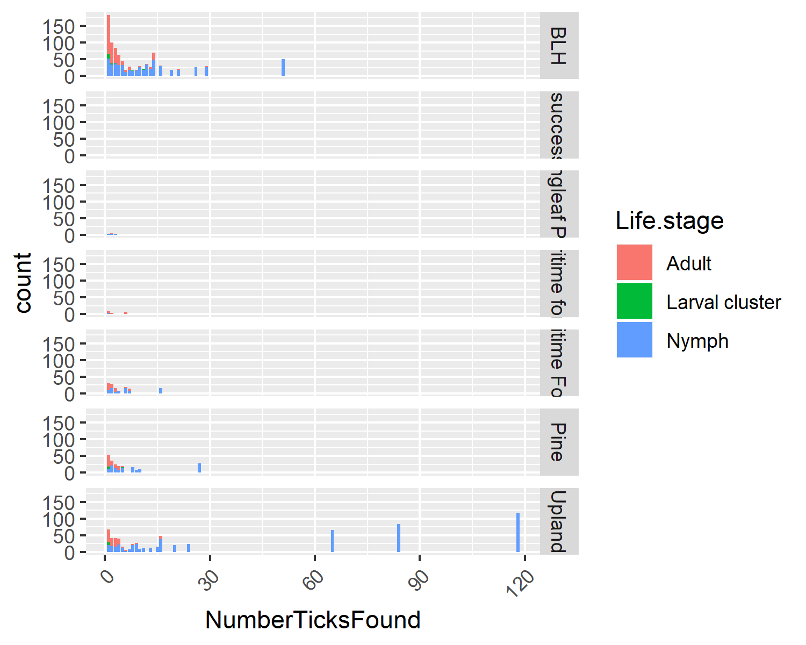

## Bivariate Analysis
  
Figure 1. Tick lifestage versus the habitat. This figure shows the number of individuals in each lifestage found in the different habitats.  

We can also use this dataset to see if lifestage has any relationship to habitat (fig 1). Overall, we can see that BHL and Upland have the most ticks of any lifestage found throughout it. However, there are pockets in Upland that have large numbers of nymphs found. Despite equal sampling efforts certain habitats had significantly lower amounts of ticks found in them. 

### Looking at linear models
```{r simplelm, echo = FALSE }
library(ggplot2)
library(dplyr)
library(pander)
library(knitr)
lmtablePathHab <- readRDS("../../results/resulttablePathHab.rds")
lmtablePathSea <- readRDS("../../results/resulttablePathSea.rds")
lmtablePathSpe <- readRDS("../../results/resulttablePathSpe.rds")
lmtableBor <- readRDS("../../results/resulttableBor.rds")

kable(lmtablePathHab, caption = "Table 1. How the different habitats are related to total pathogen")

kable(lmtablePathSea, caption = "Table 2. How the different season are related to total pathogen")

kable(lmtablePathSpe, caption = "Table 3. How the different species are related to total pathogen")

kable(lmtableBor, caption = "Table 4. How the different regions are related to Borrelia.spp in Ixodes scapularis")
```
